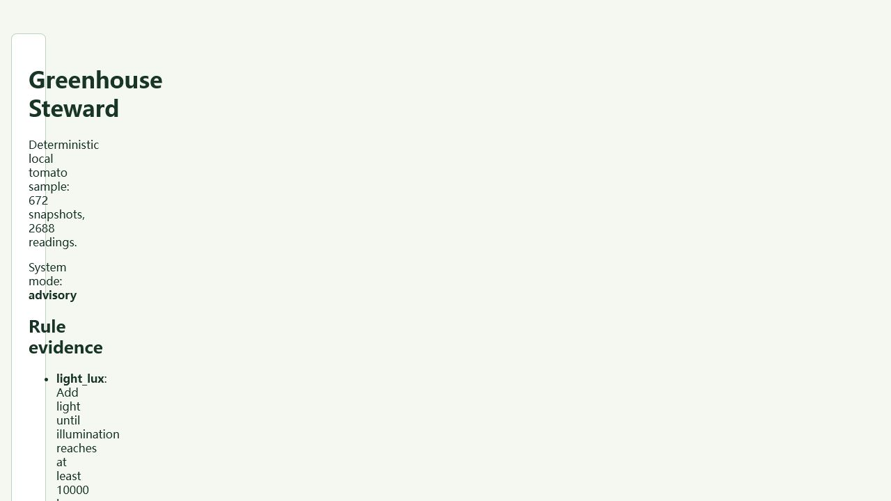

# Greenhouse Steward

[简体中文](README.zh-CN.md) · [MIT](LICENSE) · **Status: v0.1.0**

Local-first greenhouse monitoring for growers, classrooms, and makers who need
clear recommendations without surrendering their sensor history. It accepts
canonical CSV or MQTT v1 telemetry, persists locally in SQLite, and explains
each rule hit with its observed value, threshold, and recommendation.



> The screenshot is captured from the published Pages demo generated from the
> bundled tomato telemetry. It contains no user data and is not a mockup.

- **Understandable:** crop profiles, anomalies, stale sensors, daily/weekly
  trends, and evidence for every recommendation.
- **Local and portable:** no cloud account; SQLite-backed readings export as
  CSV or JSON.
- **Safe by default:** relay operation is simulation only, bounded by each
  profile; ESP32 sample firmware starts with physical output disabled.

## Quick start

```bash
python -m venv .venv
python -m pip install -e ".[dev]"
greenhouse-steward analyze --sample tomato-7d --db greenhouse.sqlite3
greenhouse-steward serve --db greenhouse.sqlite3
```

Open `http://127.0.0.1:8000/dashboard`. The server refuses non-loopback binds.

## A real input → output

The canonical CSV schema is:

```csv
timestamp,temperature_c,humidity_pct,soil_moisture_pct,light_lux
2026-01-05T00:00:00Z,22.4,63.1,48.8,12400
```

```bash
greenhouse-steward analyze --csv readings.csv --device-id bed-a --profile tomato --db greenhouse.sqlite3
greenhouse-steward export bed-a --format json --db greenhouse.sqlite3
```

The second command emits persisted status, rule evidence, watering safety,
anomalies, and trends—not prebuilt output. `tomato-7d` and `herb-7d` are
deterministic seven-day fixtures included in the package.

## Interfaces

- **CLI:** `analyze`, `profiles`, `export`, `mqtt validate`, `mqtt ingest`, and
  `relay simulate` all call the same application layer.
- **Web/API:** FastAPI dashboard, CSRF-protected form actions, JSON endpoints,
  explicit error states, keyboard skip link, compact 320px layout, and local
  Plotly assets.
- **MQTT:** topic `greenhouse/{device_id}/telemetry`; TLS is required unless an
  explicit loopback-only development exception is configured.

## Safety and privacy

Readings and profile-derived reports stay on the chosen machine. MQTT passwords
are never included in validation errors or exported output. This is monitoring
and simulation software, not a controller for pumps, heating, lighting, or
life-safety equipment. See [privacy and security](docs/PRIVACY_AND_SECURITY.md).

## Development and verification

```bash
make verify
make demo
make package
make release-check
```

Without `make`, run `python scripts/verify.py`, `python scripts/demo.py`,
`python scripts/package_release.py`, and `python scripts/release_check.py`.
`make demo` writes an inspectable generated report under `artifacts/`.

## Architecture and project notes

The domain core is independent of FastAPI, Paho, SQLite, and files; adapters
feed a shared application facade used by CLI and Web. See
[architecture](docs/ARCHITECTURE.md), [competitor scan](docs/COMPETITOR_SCAN.md),
[contributing](CONTRIBUTING.md), and the [release checklist](docs/RELEASE_CHECKLIST.md).

Public-repository sampling found no active same-name, highly isomorphic project;
the deliberate difference is a local, explainable rules workflow with a
simulation-only safety boundary rather than remote fleet control.
